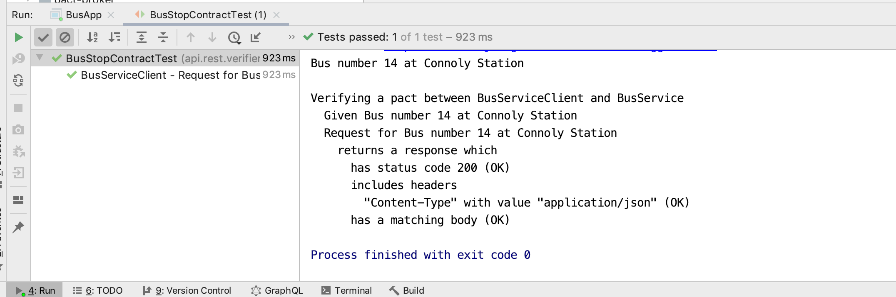
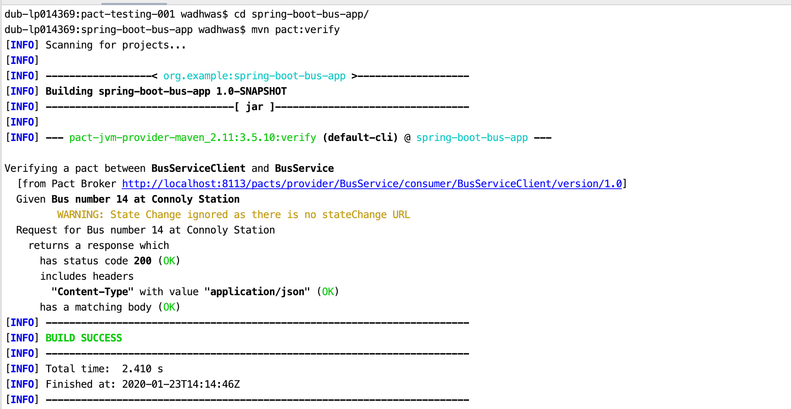
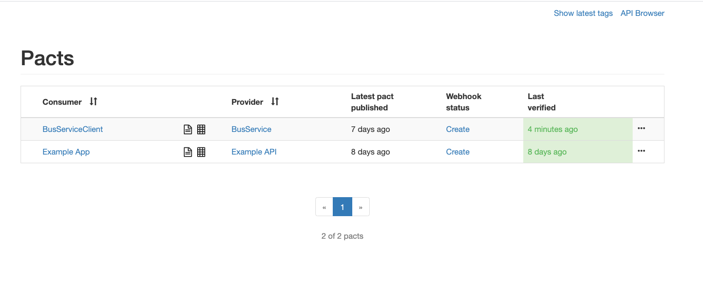

### CONTRACT TESTING USING PACT

1. Project Structure

    `spring-boot-bus-app`: A maven project for Spring based REST API to provide
     the Expected Time of Arrival (ETA) of a bus given a Station and the 
     Bus Number.
    
    `bus-client`: A maven project for CONSUMER, containing the Mock-Provider to generate
    the pacts. 
    
    `pact-broker`: Contains a docker-compose file for spinning up the local pact broker and a postgres database
    
    
   
### How to use the project

#### 1. Running the Spring Boot Application
        
* Goto spring-boot-bus-app/src/main/java/api/rest/bus

        Run the main method in BusApp Class
        
   This will start the spring-boot application at `port 8111`

 * Check the response for HTTP Request:

        GET Request Endpoint: http://localhost:8111/bus/connolly/1000
        
        or 
        Execute this command on terminal:
        
        curl --location --request GET 'http://localhost:8111/bus/connolly/1000'

#### 2. Generating the contract on local system:
    
 Goto `bus-client/src/test/java/api/rest/client/`
        
        Execute the method --> busArrivalTest()
        
 This method generated contract with the `Mock Provider` which runs at port 8112
  
 
        
Check the contracts inside:
            
            bus-client/target/pacts/
 
 #### 3. Verifying the Contracts with Actual Provider
        
Goto `bus-client/src/test/java/api/rest/verifier/`
        
     Run the class  BusStopContractTest
        
 This verifies the Contract generated in Step-3 with Actual Provider application runing at port 8111
 
 The output should look like:
 
 

#### 4. Publishing the Results to Pact broker

The pact broker can be executed locally in the Docker containers.

Inside the `pact-broker` directory, setup the infrastructure in the `docker-compose.yml`
by executing following command:

        >> docker-compose up
        
This runs the Pact-Broker at: http://localhost:8113/

To verify the Comsumer Contract with the Provider through the Pact Broker,

Goto `spring-boot-bus-app`  

Execute following command:
    
    >> mvn pact:verify 

Output looks as follows:

 
 
 On the Browser (http://localhost:8113/)
 
 
